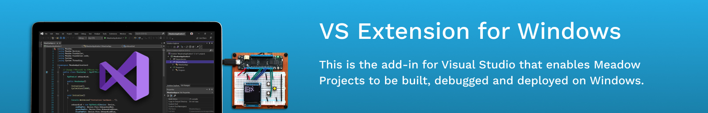

## Build Status 

## Getting Started

To develop for this extension, you will need some prerequisites.

The [Meadow.CLI](https://github.com/WildernessLabs/Meadow.CLI) repo must be cloned adjacent to this checkout using the `develop` branch. This repo is used to resolve shared code and project references.

You will also need the **Visual Studio extension development** and **.NET desktop environment** workloads. Visual Studio should prompt to install these the first time you open one of the extension solutions.

## License

Released under the [Apache 2 license](license.md).

## Authors

Brian Kim, Adrian Stevens, Jorge Ramirez, Dominique Louis
