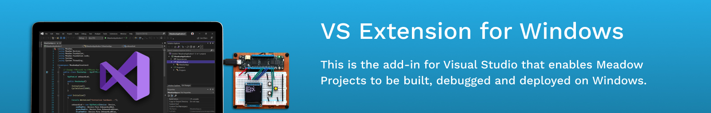

## Build Status 

## Overview

The Meadow VS2022 extension provides integrated project templates, build tasks, and debugging support for Meadow applications. The extension uses the Debug Adapter Protocol (DAP) to handle all debugging operations, which allows us to share a single debugging implementation across Visual Studio, Visual Studio Code, and Rider.

## Device Selection

The toolbar includes a device dropdown showing your connected Meadow devices. Before you deploy or debug, just pick which device you want to use. The dropdown shows each device with a status icon and its COM port—for example: `✓ Meadow [COM11]`

**Status Icons:**
- ✓ **Available** - Ready to deploy and debug
- ● **Connected** - Currently debugging
- ⚠ **Busy** - In use by another app
- ✗ **Error** - Something's wrong
- ○ **Unknown** - Status unclear

The list refreshes automatically when you open it, and it caches the device info so it loads fast.

## Architecture

### Debug Adapter Protocol (DAP)

Starting with the current generation, the VS2022 extension (like VSCode and Rider) communicates with a shared DAP adapter to handle all deploy and debug operations. This centralized approach means:

- One codebase handles debugging for all three IDEs
- Consistent behavior across Visual Studio, VSCode, and Rider
- Easier maintenance and fewer bugs

The DAP adapter is located in the Meadow.Debugging repository and implements the protocol that allows the IDE to control device deployment and debugging sessions.

### Debug Flow

When you hit F5 to deploy and debug a Meadow application:

1. The VS2022 extension calls MeadowDebuggerLaunchProvider, which prepares the launch configuration
2. VS2022's built-in Debug Adapter Host launches the meadow-debugging.exe process
3. The DAP adapter receives the launch request and handles deployment to the device
4. Once deployed, the adapter establishes a debugging session with the device's Mono debugger
5. Control and debug events flow between the IDE and device through the adapter
6. When you stop debugging, the adapter cleanly resumes the device and closes all connections

The key insight is that the IDE doesn't directly talk to the device. The DAP adapter sits in the middle and handles all the complexity of deployment, connection management, and device state.

### Why This Matters

By using DAP, we've standardized on a single debugging backend that works the same way regardless of which IDE you're using. This means the team spends less time fixing IDE-specific issues and more time improving the actual debugging experience.

## Getting Started

To develop for this extension, you will need some prerequisites.

The [Meadow.CLI](https://github.com/WildernessLabs/Meadow.CLI) repo must be cloned adjacent to this checkout using the develop branch. This repo is used to resolve shared code and project references.

You will also need the Visual Studio extension development and .NET desktop environment workloads. Visual Studio should prompt to install these the first time you open one of the extension solutions.

## Building and Testing

After cloning, open the VS_Meadow_Extension.2022.sln solution. The solution includes both the extension code and references to the necessary Meadow.CLI components.

When testing, you're essentially testing the launch flow. The actual debugging happens through the DAP adapter, which lives in the Meadow.Debugging repository. If you need to debug the adapter itself, refer to the Meadow.Debugging documentation.

## Debugging Support

The extension supports debugging Meadow applications running on compatible hardware. The debugger provides standard IDE features like breakpoints, stepping, variable inspection, and call stacks.

One important note: debug sessions are now properly cleaned up when you stop debugging. The device is resumed and left in a clean state, allowing you to immediately redeploy and debug again without requiring a hardware reset.

## File Logging for Diagnostics

By default, the DAP adapter runs with tracing enabled but does not write to a log file. This keeps the user's system clean while still allowing us to capture diagnostic information if needed.

If you need to enable file logging to troubleshoot a specific issue, you can modify the MeadowDebugAdapter.pkgdef file:

In VS_Meadow_Extension.2022\MeadowDebugAdapter.pkgdef, change this line:

    "AdapterArgs"="--trace"

To this:

    "AdapterArgs"="--trace --log-file=C:\temp\meadow_dap.log"

The adapter will then write detailed protocol messages and events to the specified log file. This is useful for understanding what's happening during deployment and debugging. Just remember to change it back when you're done, or the log file will grow indefinitely on the user's system.

## License

Released under the [Apache 2 license](license.md).

## Authors

Brian Kim, Adrian Stevens, Jorge Ramirez, Dominique Louis
